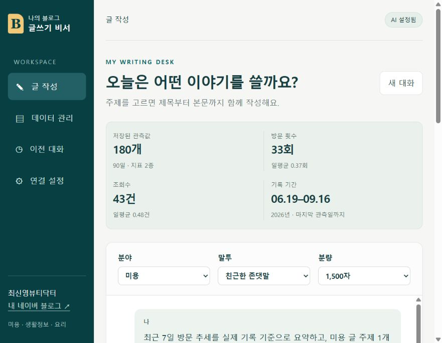
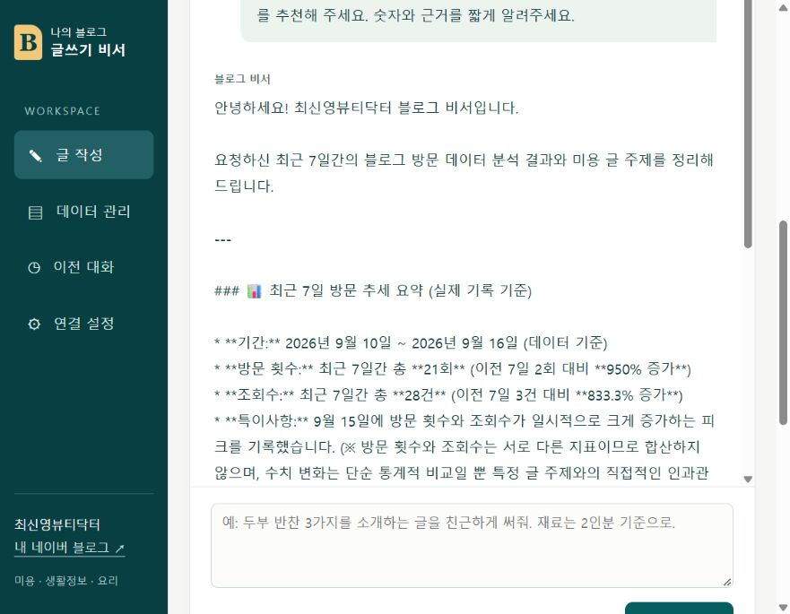
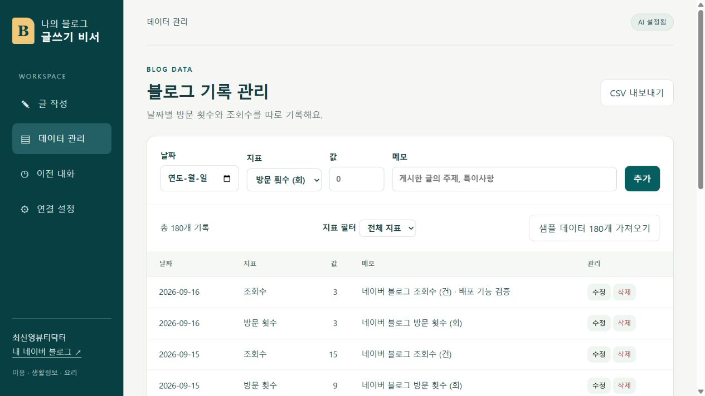
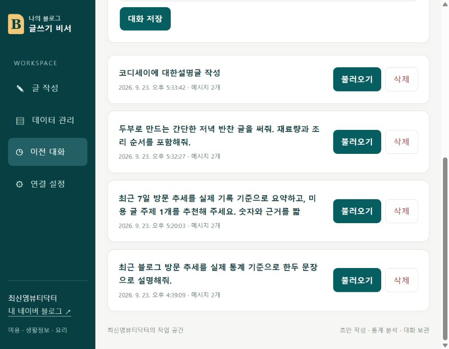

# 나의 블로그 비서 — 공개 제출용 소스

미용·생활정보·요리 글 초안을 작성하고, 날짜별 블로그 지표를 요약해 질문에 반영하는 개인용 웹 앱입니다. AI 답변은 대화 기록으로 자동 저장됩니다.

이 저장소의 `backend/seed.json`과 `frontend/seed.json`은 **시연용 가상 데이터**입니다. 날짜별 실제 네이버 블로그 통계와 API 키는 공개 저장소에 포함하지 않았습니다. 서비스 운영 DB인 Firestore에는 소유자가 별도로 가져온 실제 관측값 180개(90일 × 방문 횟수·조회수)가 저장되어 있습니다. 두 지표를 합쳐 100일이나 단일 지표 100개라고 주장하지 않습니다.

## 기능

- AI 채팅: 데이터 요약을 시스템 지침에 넣어 Gemini 또는 OpenAI로 답변하고, 로딩 표시와 대화 자동 저장을 제공합니다.
- 데이터 관리: 날짜·값·메모·지표를 추가, 조회, 수정, 삭제합니다. 기간, 합계, 평균, 최소·최대, 최근 추세를 표시합니다.
- 대화 기록: 저장, 목록, 특정 대화 불러오기, 삭제를 지원합니다.
- 부가 기능: 최근 30일 그래프, CSV 내보내기, 글 초안 복사.

## 기술 스택

FastAPI, Pydantic, firebase-admin/Firestore, OpenAI Python SDK(Gemini 공식 호환 엔드포인트), Uvicorn. 프론트는 HTML/CSS/바닐라 JavaScript이며 Vercel, 백엔드는 Render 배포를 전제로 합니다.

## 배포 URL

| 화면 | URL |
|---|---|
| 프론트엔드 | [Vercel 홈페이지](https://ai-blog-assistant-public.vercel.app/) — 배포 완료 |
| 백엔드 API | [Render API](https://personal-blog-assistant-api.onrender.com/) |
| Swagger UI | [API 문서](https://personal-blog-assistant-api.onrender.com/docs) |

무료 Render 인스턴스가 잠들어 있으면 첫 접속이 지연됩니다. 첫 상태 확인과 초기 데이터 요청은 최대 90초 기다리고, 일시적인 502·503·504·네트워크 오류에는 한 번 자동 재시도합니다. 그래도 실패하면 화면의 **연결 다시 시도**를 누르면 됩니다. 초기 목록과 요약은 `/api/bootstrap` 한 번으로 받아 Firestore 중복 조회를 줄였습니다. 무료 서버의 잠자기 자체를 없애는 기능은 아닙니다.

## 로컬 실행

Python 3.10 이상이 필요합니다.

```powershell
cd backend
python -m venv .venv
.\.venv\Scripts\python.exe -m pip install -r requirements-dev.txt
Copy-Item .env.example .env
.\.venv\Scripts\python.exe -m uvicorn main:app --host 127.0.0.1 --port 8765
```

`http://127.0.0.1:8765/`에서 앱을, `/docs`에서 Swagger를 확인할 수 있습니다. 시작 시 **샘플 데이터 180개 가져오기**를 누르면 가상 데이터로 기능을 시연할 수 있습니다. 실제 데이터는 소유자가 Firestore에 별도로 넣어야 합니다. 프론트 빌드는 `cd frontend; $env:API_BASE_URL='https://BACKEND.onrender.com'; node build.mjs`입니다.

## 환경 변수

| 변수 | 설명 |
|---|---|
| `AI_PROVIDER` | `gemini`(기본) 또는 `openai` |
| `GEMINI_API_KEY` / `OPENAI_API_KEY` | 선택한 AI 제공자 비밀 키 |
| `GEMINI_MODEL` / `OPENAI_MODEL` | 사용할 모델 |
| `FIREBASE_SERVICE_ACCOUNT_JSON` | 서버 전용 서비스 계정 JSON 전체 문자열 |
| `STORAGE_BACKEND` | 로컬 `sqlite`, 배포 `firestore` |
| `APP_ENV` | 로컬 `development`, 배포 `production` |
| `APP_ACCESS_TOKEN` | 개인 서비스 접근키. 배포 필수, 프론트 빌드에 포함 금지 |
| `ALLOWED_ORIGINS` | Vercel 주소를 포함한 CORS 허용 출처 |
| `API_BASE_URL` | Vercel 빌드에 전달할 Render HTTPS 주소. 공개 주소만 기록 |

`.env`, 서비스 계정 키, SQLite DB는 Git에서 제외합니다. 프론트 앱은 브라우저 탭의 `sessionStorage`에 접근키를 보관합니다. Firebase 클라이언트 직접 접근은 필요하지 않으므로 Firestore 규칙은 거부로 둘 수 있습니다.

배포 앱의 실제 데이터·채팅은 개인 서비스 접근키 입력 후 사용할 수 있습니다. 평가자에게는 접근키를 별도 비공개 경로로 전달해야 하며 공개 저장소에는 올리지 않습니다.

## 데이터와 API

`data/{id}`에는 `date`, `value`, `memo`, `metric`, `unit`, `updated_at`을 저장합니다. `conversations/{id}`에는 제목, 전체 `messages`, 갱신 시각을 저장합니다. Pydantic이 날짜, 음수, 지표 종류, 메시지 길이 등을 검사합니다.

- `POST /api/data`, `GET /api/data`, `PUT /api/data/{id}`, `DELETE /api/data/{id}`
- `GET /api/data/summary`, `GET /api/bootstrap`, `POST /api/data-import`
- `POST /api/conversations`, `GET /api/conversations`, `GET /api/conversations/{id}`, `DELETE /api/conversations/{id}`
- `POST /api/chat`, `GET /health`, `GET /docs`

요청 → 데이터 요약 → 시스템 지침에 삽입 → Gemini 호출 → 답변과 대화 Firestore 저장의 순서로 동작합니다. 최신 생활정보나 효과를 실시간 검증하지 않으므로 게시 전에 공식 근거를 확인해야 합니다. 네이버 자동 발행은 제공하지 않습니다.

## 배포

1. Render에서 이 GitHub 저장소의 `render.yaml` Blueprint 또는 `backend` 폴더로 Python Web Service를 만듭니다. 비밀 환경 변수를 Render에만 입력합니다.
2. Vercel에서 같은 저장소를 가져오되 Root Directory를 `frontend`, Framework를 Other로 지정합니다. `API_BASE_URL`에는 실제 Render HTTPS URL을 설정합니다.
3. Vercel 배포 URL을 Render의 `ALLOWED_ORIGINS`에 추가한 뒤 재배포합니다.
4. 프론트 연결 설정에 서비스 접근키를 입력하고 채팅, CRUD, 대화 불러오기, Swagger를 확인합니다.

분당 5회·시간당 30회 AI 호출 제한과 최대 출력 토큰 제한이 있으며 Gemini API 사용료가 발생할 수 있습니다.

## 검증 및 제출 화면

`cd backend; .\.venv\Scripts\python.exe -m pytest tests -q`로 분석·API 테스트 12개를 실행합니다. 아래 화면은 서비스 기능을 확인할 수 있도록 캡처한 예시입니다. 배포가 잠들어 있다면 먼저 Render Swagger를 열고, Vercel 화면에서 잠시 기다리거나 연결을 다시 시도해 주세요.

| 제출 화면 | 캡처 |
|---|---|
| 데이터 요약과 채팅 | [요약과 질문](submission-screenshots/01-chat-and-summary.png) · [Gemini 답변](submission-screenshots/01b-chat-answer.png) |
| 데이터 관리 | [수정한 데이터 목록](submission-screenshots/02-data-edit.png) |
| 대화 기록 | [저장된 대화와 불러오기](submission-screenshots/03-conversation-list.png) |
| API 문서 | [Render Swagger UI](submission-screenshots/04-swagger.png) |

캡처 시점과 내용은 [화면 캡처 설명](submission-screenshots/README.md)을 참고하세요.








